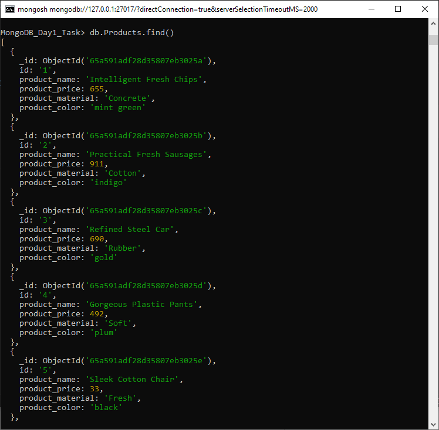
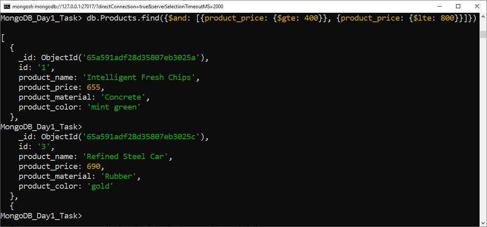
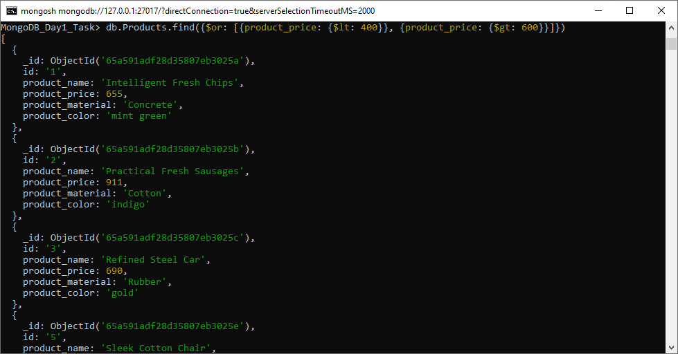
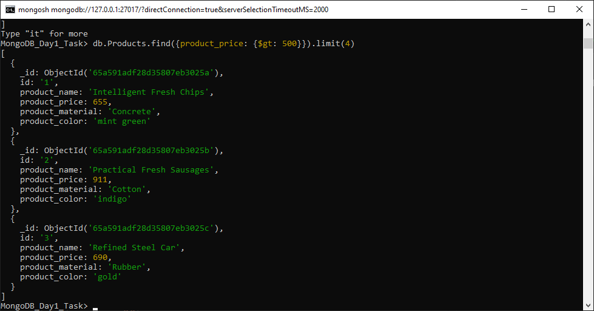
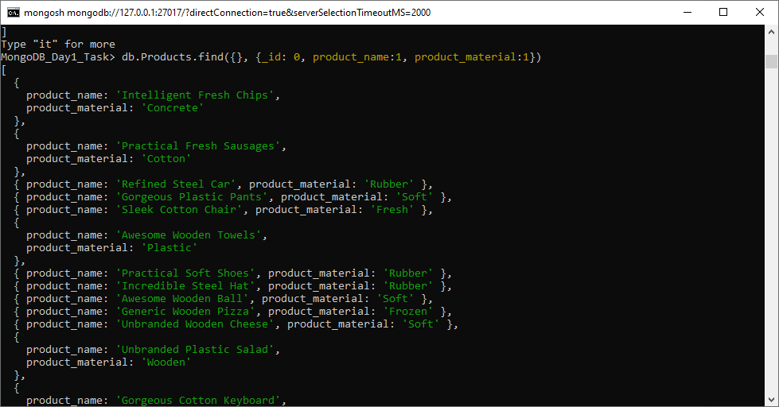
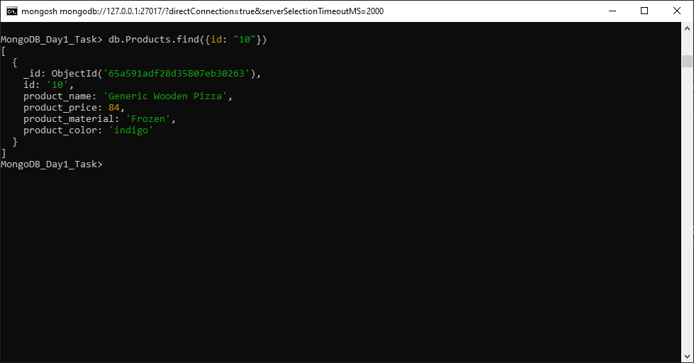
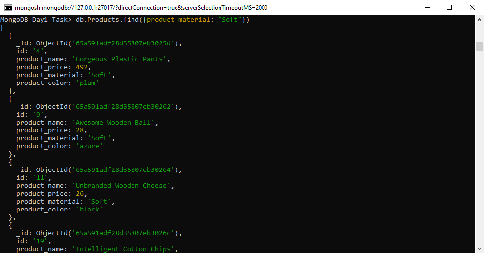
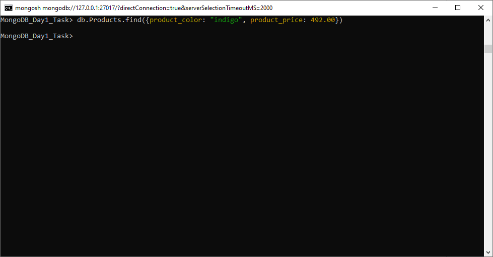

```
Collection name: Products
```

## Q1. Find all the information about each products

Query:
```
db.Products.find()
```


## Q2. Find the product price which are between 400 to 800

Query:
```
db.Products.find({
    $and: [{product_price: {$gte: 400}}, {product_price: {$lte: 800}}]
})
```


## Q3. Find the product price which are not between 400 to 600

Query:
```
db.Products.find({
    $or: [{product_price: {$lt: 400}}, {product_price: {$gt: 600}}]
})
```


## Q4. List the four product which are grater than 500 in price

Query:
```
db.Products.find({product_price: {$gt: 500}}).limit(4)
```


## Q5. Find the product name and product material of each products

Query:
```
db.Products.find({}, {_id: 0, product_name:1, product_material:1})
```


## Q6: Find the product with a row id of 10

Query:
```
db.Products.find({id: "10"})
```


## Q7: Find only the product name and product material

Query:
```
db.Products.find({}, {_id: 0, product_name:1, product_material:1})
```


## Q8: Find all products which contain the value of soft in product material 

Query:
```
db.Products.find({product_material: "Soft"})
```


## Q9: Find products which contain product color indigo  and product price 492.00

Query:
```
db.Products.find({product_color: "indigo", product_price: 492.00})
```


## Q10: Delete the products which product price value are same

Query:
```
```
<>